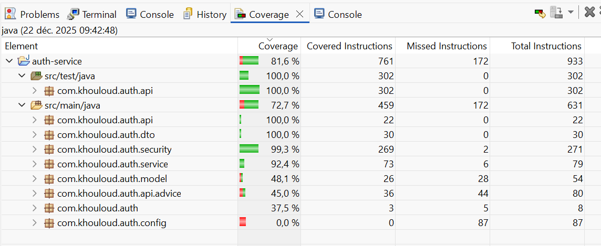

# Authentication Service

## Overview

A stateless JWT-based authentication system using Spring Boot, Java, and MySQL.
This project demonstrates secure authentication, role-based access, and best practices for building REST APIs with JWT.

---

## Technology Stack

* **Java**: 21
* **Spring Boot**: 3.5.8
* **Spring Security**: 6.5.7
* **Authentication**: Stateless JWT
* **Database:** MySQL
* **JWT Library**: jsonwebtoken 0.11.5
* **Build Tool**: Maven
 
---
  

## Features

* User registration and login (stateless JWT)
* Custom AuthenticationProvider for authentication logic
* SecurityFilterChain for configuring HTTP security
* JWT token validation implemented in doFilterInternal() of JwtAuthenticationFilter
* Role-based access control(USER / ADMIN)
* Global exception handling (@RestControllerAdvice)
* Thin controllers and service layer separation
* Password encoding with BCrypt

---

## Bootstrap Data (Roles & Default Users)

The application automatically creates default roles and users at startup for development and testing. This is implemented in com.khouloud.auth.config.DataInitializer.

### Default Roles
`USER`

`ADMIN`

| Username    | Full Name            | Roles       | Password  |
|-------------|----------------------|-------------|-----------|
| user@email  | Default User         | USER        | change-me |
| admin@email | System Administrator | ADMIN, USER | change-me |


## Test Coverage

This project focuses on integration testing to validate:
- JWT authentication flow
- Spring Security filter chain
- Protected vs public endpoints
- Real HTTP request/response behavior

---


## Run Spring Boot application
```bash
mvn spring-boot:run

